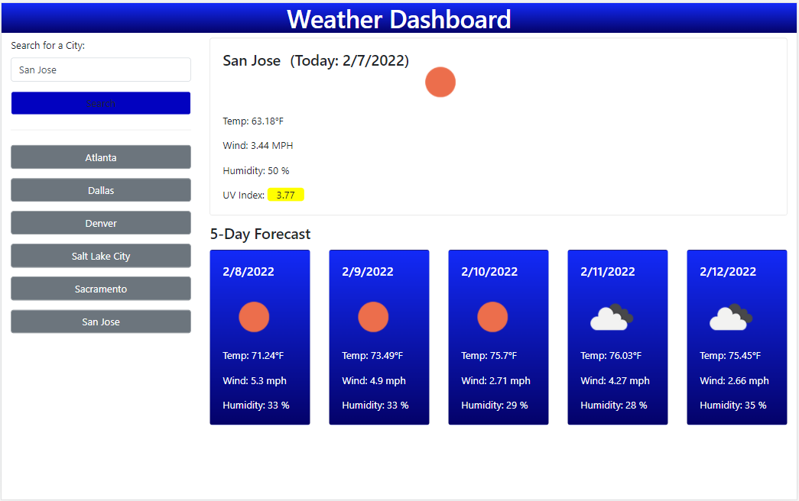

# weather-app
Bootcamp Week 6: Homework
# 06 Server-Side APIs: Weather Dashboard

## Task Requirements

Third-party APIs allow developers to access their data and functionality by making requests with specific parameters to a URL. Developers are often tasked with retrieving data from another application's API and using it in the context of their own. Your challenge is to build a weather dashboard that will run in the browser and feature dynamically updated HTML and CSS.

Use the [OpenWeather One Call API](https://openweathermap.org/api/one-call-api) to retrieve weather data for cities. Read through the documentation for setup and usage instructions. You will use `localStorage` to store any persistent data. For more information on how to work with the OpenWeather API, refer to the [Full-Stack Blog on how to use API keys](https://coding-boot-camp.github.io/full-stack/apis/how-to-use-api-keys).

## User Story
```
AS A traveler
I WANT to see the weather outlook for multiple cities
SO THAT I can plan a trip accordingly
```
## Solution

A weather dashboard includes to view:
 1. a search option with form inputs to search for a city  
 2. a list of cities that are searched is saved for search history 
 3. a current and five-day forecast for the searched city

First, enter the city name with form inputs to search for a city. /function getCityName()/

Once we got the city name, it is checked through the Server-Side-API data. To connect with OpenWeather One Call API we need to register and get an API key. To get forecast data, 2 layered fetch() were used. The first one is to find a city, then use that city coordinates to find current and daily forecast. /function getApi()/

The current city forecast is presented with current and future conditions:

To view current weather conditions for that city, it is presented with the city name, the date, an icon representation of weather conditions, the temperature, the humidity, the wind speed, and the UV index.

To view future weather conditions for that city, it is presented with a 5-day forecast that displays the date, an icon representation of weather conditions, the temperature, the wind speed, and the humidity.

After the city name is searched it is saved in the search history as a button type. Also, the city name is stored at localStorage and cityArray for persistent data use. When the button is clicked on a city in the search history then it is presented again with current and future conditions for that city. /function showSearchedCityForecast()/

The UV index is presented with a color that indicates whether the conditions are safe (0 to 2 low), moderate (3 to 7), or severe (8 to 10+). The UV index scale is used according to the United States EPA guideline (Environmental Protection Agency). /function colorUvi()/

- LOW - Green (safe)
- MODERATE - Yellow
- HIGH -Orange
- VERY HIGH - red
- EXTREME - Purple

A default city is Atlanta. For this application, the localStorage is used, so before we use it needs to be cleared.  /function init()/

## Mock-Up

The following image shows the web application's appearance and functionality:
